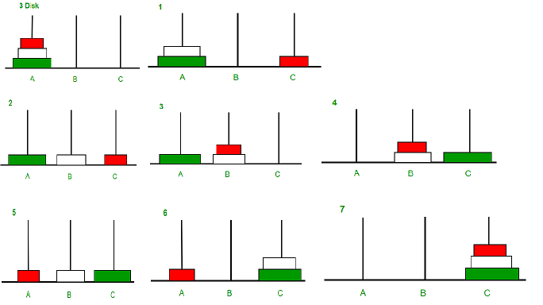

# Recursion

## Tower of Hanoi

Tower of Hanoi is a mathematical puzzle where we have three rods and n disks. The objective of the puzzle is to move the entire stack to another rod, obeying the following simple rules: 

1. Only one disk can be moved at a time.
2. Each move consists of taking the upper disk from one of the stacks and placing it on top of another stack i.e. a disk can only be moved if it is the uppermost disk on a stack.
3. No disk may be placed on top of a smaller disk.

Just remember : `132->123->231`

```text
Take an example for 2 disks :
Let rod 1 = 'A', rod 2 = 'B', rod 3 = 'C'.

Step 1 : Shift first disk from 'A' to 'B'.
Step 2 : Shift second disk from 'A' to 'C'.
Step 3 : Shift first disk from 'B' to 'C'.

The pattern here is :
Shift 'n-1' disks from 'A' to 'B'.
Shift last disk from 'A' to 'C'.
Shift 'n-1' disks from 'B' to 'C'.

Image illustration for 3 disks :
```



```text
Input : 2
Output : Disk 1 moved from A to B
         Disk 2 moved from A to C
         Disk 1 moved from B to C

Input : 3
Output : Disk 1 moved from A to C
         Disk 2 moved from A to B
         Disk 1 moved from C to B
         Disk 3 moved from A to C
         Disk 1 moved from B to A
         Disk 2 moved from B to C
         Disk 1 moved from A to C
```

```java
class Program
{
    static void towerOfHanoi(int n, char from_rod,
                        char to_rod, char aux_rod) 
    { 
        if (n == 1) 
        { 
            System.out.println("Move disk 1 from rod "+ 
                               from_rod+" to rod "+to_rod); 
            return; 
        } 
        towerOfHanoi(n - 1, from_rod, aux_rod, to_rod); 
        System.out.println("Move disk "+ n + " from rod " + 
                           from_rod +" to rod " + to_rod ); 
        towerOfHanoi(n - 1, aux_rod, to_rod, from_rod); 
    } 
     
    // Driver code
    public static void  main(String args[]) 
    { 
        int n = 4; // Number of disks 
        towerOfHanoi(n, 'A', 'C', 'B'); // A, B and C are names of rods 
    } 
}
```

## To check the given string is palindrome or not 

```java
// Java program for power set 
import java.util.*;
import java.lang.*;
import java.io.*; 
  
class Program 
{ 
    // A recursive function that  
    // check a str(s..e) is  
    // palindrome or not. 
    static boolean isPalRec(String str,  
                            int s, int e) 
    { 
        // If there is only one character 
        if (s == e) 
            return true; 
  
        // If first and last  
        // characters do not match 
        if ((str.charAt(s)) != (str.charAt(e))) 
            return false; 
  
        // If there are more than  
        // two characters, check if 
        // middle substring is also 
        // palindrome or not. 
        if (s < e + 1) 
            return isPalRec(str, s + 1, e - 1); 
  
        return true; 
    } 
  
    static boolean isPalindrome(String str) 
    { 
        int n = str.length(); 
  
    // An empty string is  
    // considered as palindrome 
        if (n == 0) 
            return true; 
  
        return isPalRec(str, 0, n - 1); 
    } 
  
    // Driver Code 
    public static void main(String args[]) 
    { 
        String str = "geeg"; 
  
        if (isPalindrome(str)) 
            System.out.println("Yes"); 
        else
            System.out.println("No"); 
    } 
}
```

## Josephus problem

```java
// Java program for power set 

import java.util.*;
import java.lang.*;
import java.io.*; 
  
class Program 
{ 
  
    static int josephus(int n, int k) 
    { 
        if (n == 1) 
            return 1; 
        else
            /* The position returned by josephus(n - 1, k)  
            is adjusted because the recursive call  
            josephus(n - 1, k) considers the original  
            position k%n + 1 as position 1 */
            return (josephus(n - 1, k) + k-1) % n + 1; 
    } 
  
    // Driver Program to test above function 
    public static void main( ) 
    { 
    int n = 14; 
    int k = 2; 
    System.out.println("The chosen place is " + josephus(n, k)); 
    } 
} 
```

## S**um of digit of a number using recursion**

```java
import java.util.*;
import java.io.*;
import java.lang.*;

class sum_of_digits 
{ 
    // Function to check sum  
    // of digit using recursion 
    static int sum_of_digit(int n) 
    {  
        if (n == 0) 
            return 0; 
        return (n % 10 + sum_of_digit(n / 10)); 
    } 
  
    // Driven Program to check above 
    public static void main(String args[]) 
    { 
        int num = 12345; 
        int result = sum_of_digit(num); 
        System.out.println("Sum of digits is" +  result); 
    } 
}
```

## Rod cutting 

```java
// Java program for power set 
import java.util.*;
import java.lang.*;
import java.io.*; 
  
class Program
{
    static int rodCutting(int n, int a, int b, int c)
    {
        if(n== 0)
          return 0;
        if(n < 0)
          return -1;
          
        int res = Math.max(Math.max(rodCutting(n-a, a, b, c), 
                rodCutting(n-b, a, b, c)),rodCutting(n-c, a, b,c));
                
        if(res == -1)
          return -1;
        return 1+res;
    }
    
    public static void main ( ) 
    {
        int n = 25;
        int a = 11, b = 12, c = 13;
        System.out.println(rodCutting(n, a, b, c));
        
    }
}
```

## Program to print all subsets of a set given as string

```java
import java.util.*;
import java.io.*;
import java.lang.*;

class Program { 
  
// str : Stores input string  
// curr : Stores current subset  
// index : Index in current subset, curr  
static void powerSet(String str, int index,  
            String curr)  
      
{  
    int n = str.length();  
  
    // base case  
    if (index == n) 
    {  
        System.out.println(curr); 
        return;  
    }  
  
    // Two cases for every character  
    // (i) We consider the character  
    // as part of current subset  
    // (ii) We do not consider current  
    // character as part of current  
    // subset  
    powerSet(str, index + 1, curr + str.charAt(index));  
    powerSet(str, index + 1, curr); 
  
}  
  
// Driver code  
public static void main( )  
{ 
    String str = "abc";  
        int index = 0; 
        String curr=""; 
    powerSet(str,index,curr);  
  
    } 
}
```


